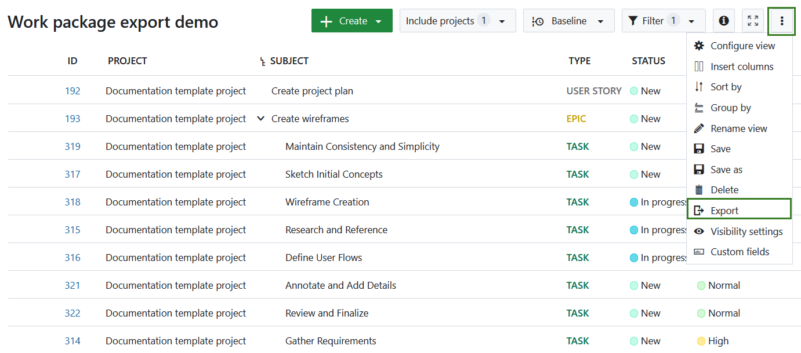
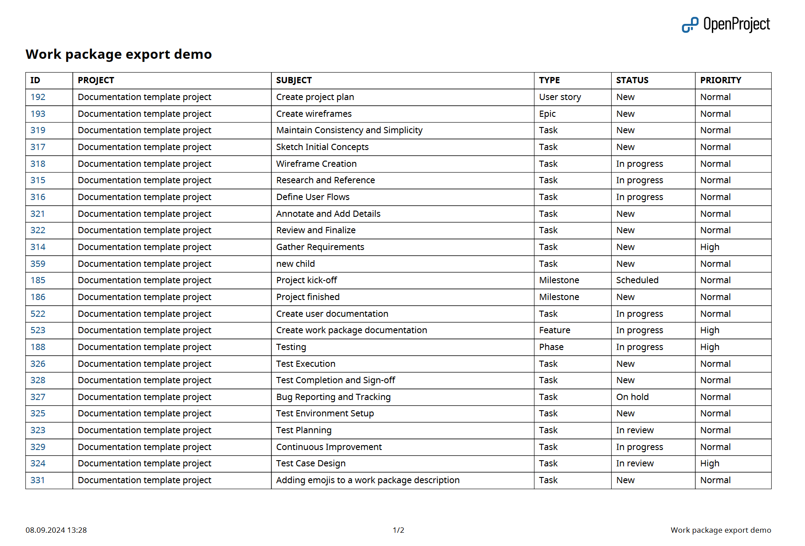
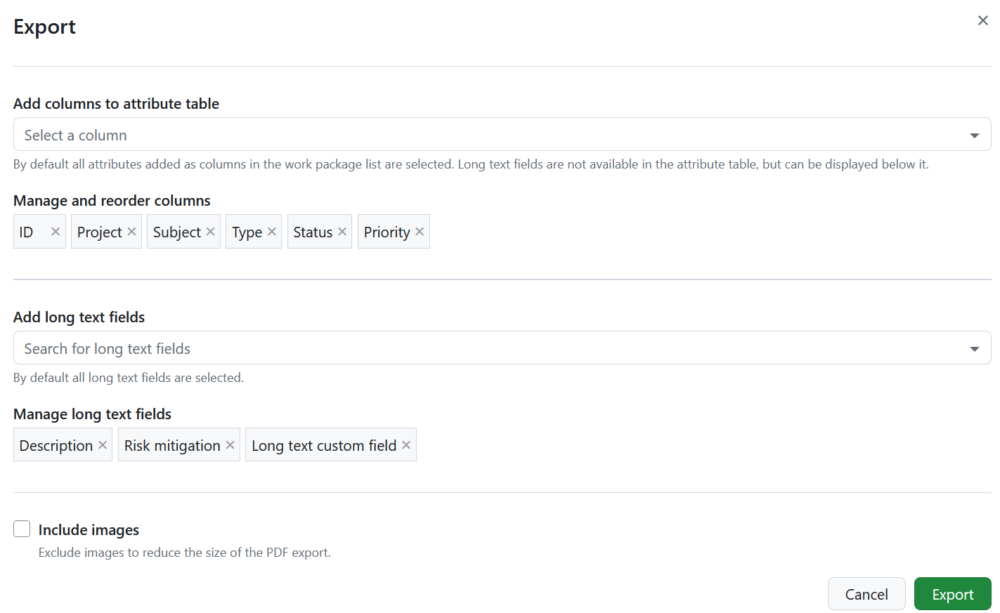
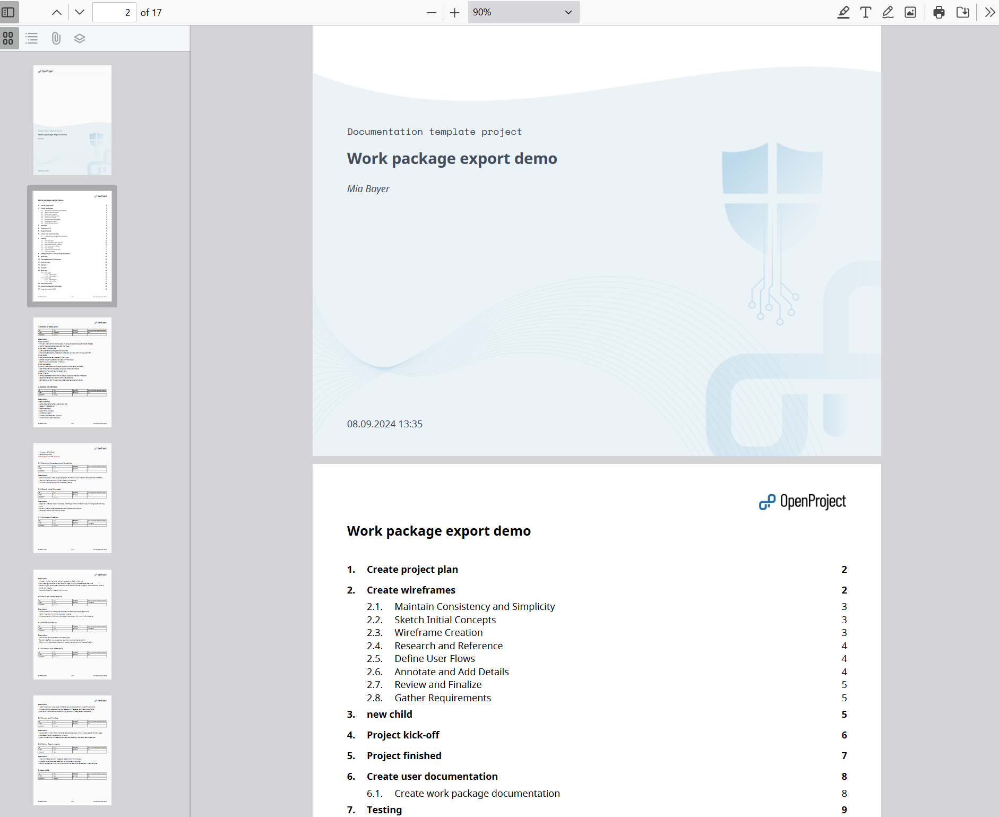
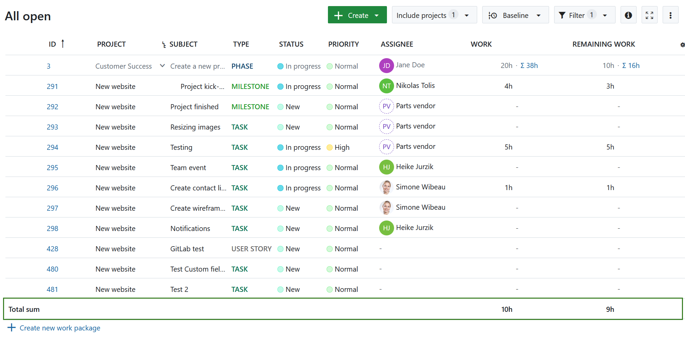
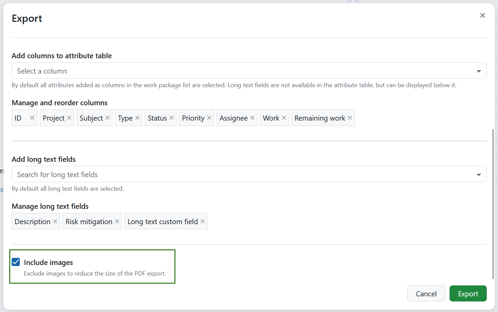
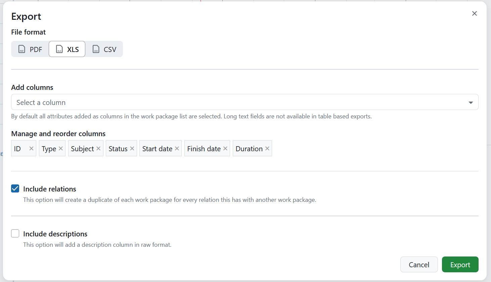
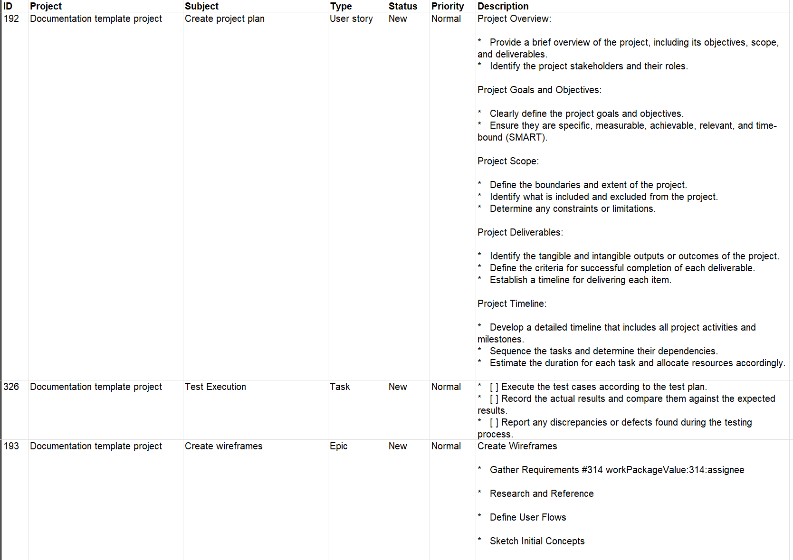

---
sidebar_navigation:
  title: Export work packages
  priority: 930
description: How to export work packages for other tools, such as Microsoft Excel
keywords: work package exports, CSV, Excel, XLS, PDF
---

# Export work packages

You can export [a single work package](#export-single-work-package) in PDF/Atom format or [multiple work packages](#export-multiple-work-packages) in PDF/XLS/CSV formats.

## Export multiple work packages

### How to trigger an export

To export work packages to another format, visit the **Work packages** module and select a default or saved work package view (table or card view) you want to export. Click on the settings icon in the top right corner. Trigger the **Export** dialog from the dropdown menu.

This will open a dialog where you can select the desired format. Click on one of the possible formats to start the export. Below, we will detail how to adjust which data should be exported as well as what the various formats contain.

### Export options

All work packages included in the work package table in the currently selected view will be exported, unless a certain export limit has been defined by the instance administrator. The limit can be changed in the [work package settings](../../../system-admin-guide/system-settings/general-settings/#general-system-settings) in the system administration. Newly created instances have a maximum of 500 work packages set as a limit by default.

> [!NOTE]
> PDF export options include all of the work packages in the selected work package table, regardless of the limit. The possible export limit is relevant for XLS, CSV and Atom export options.

**Columns**

You can choose which columns will be displayed in the table (excluding long text fields) and change their order. The pre-selected columns are the ones in the work package table query. Learn how to [save the work package view](../work-package-table-configuration/#save-work-package-views).

Some formats such as PDF will limit the number of columns available due to limitations of the PDF rendering engine to avoid overflowing the available space.

### Export format options

OpenProject has multiple file format options for exporting work packages, including PDF, XLS and CSV. See below what each format entails.

### PDF export

OpenProject has multiple options for exporting work packages in PDF format. These include table, report and Gantt chart.

#### PDF Table

PDF Table exports the work package table displaying work packages as single rows with the selected columns for the work package table. Work package IDs are linked to the respective work packages. Clicking on a work package ID will lead you directly to the work package in OpenProject.

> [!TIP]
>
> If ["display sums" is activated](../work-package-table-configuration/) in the work package table, then the sum table is included at the bottom of the exported work package table.

#### PDF Report

With PDF Reports, you can export detailed up-to-date work plans for your project in a clean and practical format. It includes a title page, a table of contents (listing all of the work packages), followed by the description of single work packages in a block form. The table of contents is clickable and is linked to the respective pages within the report, making navigation much easier.

For each work package, a table of attributes is included, where attributes correspond to the columns you specified for the export. For a [single work package export](#export-single-work-package), attributes are displayed according to the work package form configuration.

The table of attributes is followed by the work package description and, if necessary, custom long text fields, which support [embedded work package and project attributes](../../wysiwyg/#attributes).

> [!NOTE]
> Embedding of rich text, e.g. descriptions of other work packages, is currently not supported.

> [!TIP]
> If ["display sums" is activated](../work-package-table-configuration/) in the work package table, then the sum table is included between the table of contents and work packages description in an Overview section.

#### PDF Report with images

If you select the **Include images** option, your PDF Report will include the images from the work package description.

> [!NOTE]
> Images attached or linked in the work package Files section or in the Activity comments are not included in the PDF Report with images.

#### Gantt chart PDF

> [!NOTE]
> Gantt chart PDF export is an Enterprise add-on and can only be used with [Enterprise cloud](../../../enterprise-guide/enterprise-cloud-guide) or [Enterprise on-premises](../../../enterprise-guide/enterprise-on-premises-guide). An upgrade from the free Community edition is easy and helps support OpenProject.

You can export Gantt charts directly from the work packages module by selecting the respective option, or from the Gantt charts module by doing the same.

For more information on using the Gantt chart module and Gantt exports, please refer to the [Gantt chart PDF Export guide](../../gantt-chart/#gantt-chart-pdf-export-enterprise-add-on).

### XLS export (Excel)

**XLS** is a plain sheet that matches the OpenProject work packages table with its columns and work packages as rows matching the selected filter(s).

> [!TIP]
> To open XLS exported files in Microsoft Excel, ensure you set the encoding to UTF-8. Excel will not auto-detect the encoding or ask you to specify it, but simply open with the wrong encoding under Microsoft Windows.

OpenProject can export the table for Microsoft Excel with the following options:

In **XLS** format export, you can manage and reorder columns that should be included, as well as decide if relations and descriptions should be included in the report.

#### XLS with descriptions

If you activate the **Include descriptions** option, an additional column will be included in the report, showing work package descriptions.

#### XLS with relations

If you activate the **Include relations** option, additional columns to list each work package relation in a separate row will be included in the report. It will include the relation target and its ID and relation type.

#### Limitations

The OpenProject XLS export currently does not respect all options in the work package view being exported from:

- The order of work packages in a manually sorted query is not respected. This is a known limitation ([Ticket](https://community.openproject.org/projects/openproject/work_packages/34971/activity)).
- The hierarchy of work packages as displayed in the work package view. The exported XLS is always in "flat" mode.
- The description is exported in 'raw' format, so it may contain HTML tags.

### CSV export

OpenProject can export the table into a comma-separated CSV. This file will be UTF-8 encoded.

> [!TIP]
> To open CSV exported files in Microsoft Excel, ensure you set the encoding to UTF-8. Excel will not auto-detect the encoding or ask you to specify it, but simply open with the wrong encoding under Microsoft Windows.

If you select the **Include descriptions** option, the work package description field will be included in the export.

#### Limitations

The OpenProject CSV export currently does not respect all options in the work package view being exported from:

- The order of work packages in a manually sorted query is not respected. This is a known limitation ([Ticket](https://community.openproject.org/projects/openproject/work_packages/34971/activity)).
- The hierarchy of work packages as displayed in the work package view. The exported CSV is always in "flat" mode.
- The description is exported in 'raw' format, so it may contain HTML tags.

## Export single work package

It is also possible to export single work packages in PDF and Atom format. To do that, click on the settings icon in the top right corner and select the preferred format from the dropdown menu.

An exported PDF file will include all the work package fields that are [configured in the work package form](../../../system-admin-guide/manage-work-packages/work-package-types/#work-package-form-configuration-enterprise-add-on), regardless of whether they are filled out or not.

Atom Export includes a work package Title, Author, a link to the work package and work package activities.
